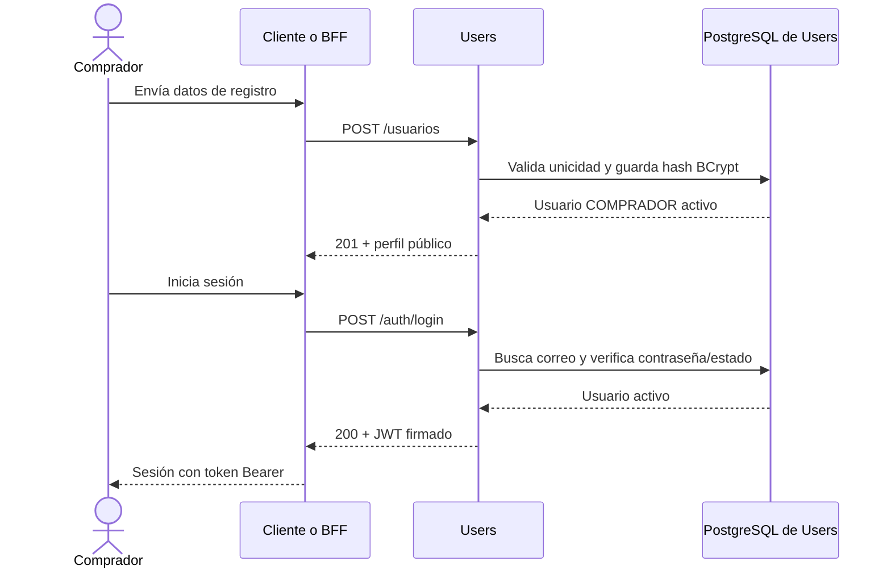
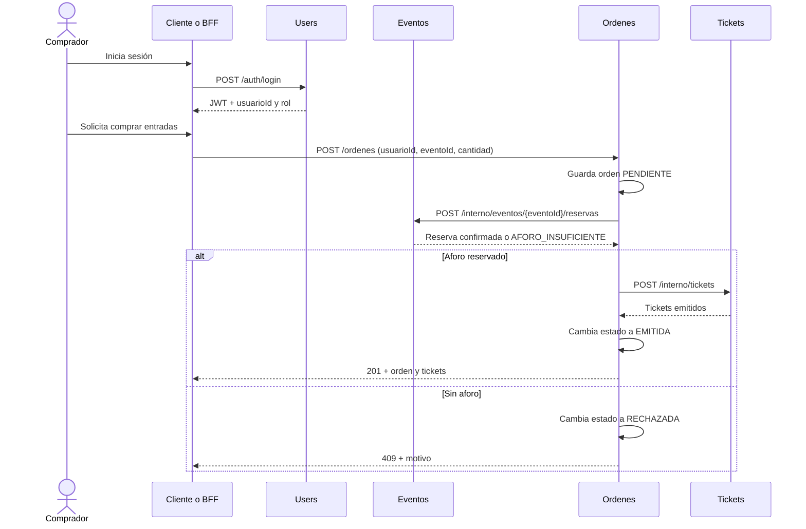

# Microservicio Users — EventPass

Users administra las cuentas y la autenticación de EventPass. Registra compradores, crea cuentas STAFF mediante una clave de provisión, inicia sesión y emite JWT para que las solicitudes autenticadas puedan ser reconocidas por los demás servicios.

Este repositorio contiene solo el microservicio Users. Cada microservicio mantiene sus propios datos y se comunica con los demás mediante HTTP/REST y JSON. El contrato local acordado está pensado para que Ordenes coordine una compra entre Eventos y Tickets.

## Qué hace

- Registra compradores con rol `COMPRADOR` asignado por el servidor.
- Crea cuentas `STAFF` mediante un endpoint protegido por una clave de provisión.
- Normaliza los correos a minúsculas y evita correos duplicados.
- Guarda contraseñas como hashes BCrypt; nunca devuelve el hash en las respuestas.
- Autentica con correo y contraseña y entrega un JWT firmado.
- Permite consultar y actualizar el perfil de la cuenta autenticada.
- Permite desactivar una cuenta sin borrar físicamente su fila de la base de datos.
- Valida JWT en sus rutas protegidas y responde con errores JSON consistentes.

El servicio no lista cuentas ni permite cambiar el rol desde el endpoint de perfil. Tampoco administra eventos, órdenes ni tickets.

## Especificaciones técnicas

| Componente | Especificación |
|---|---|
| Java | 21 |
| Spring Boot | 4.1.1 |
| Construcción | Maven Wrapper |
| Aplicación | Spring Web MVC, Spring Security, Spring Data JPA y Bean Validation |
| Base de datos | PostgreSQL |
| Tokens | JWT firmado con HMAC, usando JJWT 0.13.0 |
| Puerto local | 8080 (configurable con `SERVER_PORT`) |

La API usa rutas sin prefijo `/api`. Las contraseñas se procesan con BCrypt. El JWT incluye emisor `eventpass-users`, el id de usuario en `sub`, los claims `email` y `rol`, y las fechas `iat` y `exp`. La duración predeterminada es de 3600 segundos.

## Endpoints

Todas las rutas están bajo `http://localhost:8080` durante el desarrollo local.

| Método | Ruta | Autenticación | Descripción |
|---|---|---|---|
| `POST` | `/usuarios` | No | Registra un comprador. |
| `POST` | `/usuarios/staff` | Clave de provisión | Crea una cuenta STAFF controladamente. |
| `POST` | `/auth/login` | No | Autentica y devuelve un JWT. |
| `GET` | `/usuarios/me` | Bearer JWT | Consulta el perfil autenticado. |
| `PATCH` | `/usuarios/me` | Bearer JWT | Actualiza nombre y/o correo propios. |
| `DELETE` | `/usuarios/me` | Bearer JWT | Desactiva la cuenta propia (borrado lógico). |

### Ejemplos de uso

#### Registrar un comprador

`POST /usuarios`

```json
{
  "nombre": "Ana Pérez",
  "email": "ana@example.com",
  "contrasena": "una-clave-segura"
}
```

Responde `201 Created` con los datos públicos del usuario.

#### Crear una cuenta STAFF

`POST /usuarios/staff`, con el encabezado `X-Staff-Provision-Key` igual a `STAFF_PROVISION_KEY` configurada localmente:

```json
{
  "nombre": "Personal EventPass",
  "email": "staff@example.com",
  "contrasena": "una-clave-segura"
}
```

El rol se establece en el servidor. La clave no va en el JSON. Este mecanismo sirve para la provisión controlada del proyecto; antes de exponerlo en un entorno real se debe definir un proceso administrativo de provisión y proteger la credencial adecuadamente.

#### Iniciar sesión

`POST /auth/login`

```json
{
  "email": "ana@example.com",
  "contrasena": "una-clave-segura"
}
```

Responde `200 OK` con `token`, `tipo` (`Bearer`), `expiraEnSegundos` y `usuario`:

```json
{
  "token": "<JWT>",
  "tipo": "Bearer",
  "expiraEnSegundos": 3600,
  "usuario": {
    "id": 1,
    "nombre": "Ana Pérez",
    "email": "ana@example.com",
    "rol": "COMPRADOR",
    "activo": true
  }
}
```

Credenciales incorrectas o una cuenta inactiva responden `401 Unauthorized`.

#### Consultar perfil

`GET /usuarios/me` con `Authorization: Bearer <JWT>`. Responde `200 OK` con el perfil actual.

#### Actualizar perfil

`PATCH /usuarios/me` con `Authorization: Bearer <JWT>`. Se debe enviar al menos un campo:

```json
{
  "nombre": "Ana Pérez",
  "email": "ana.nueva@example.com"
}
```

`nombre` y `email` son opcionales por separado. El rol y el estado no se pueden editar aquí. Un correo ya ocupado responde `409 Conflict`; datos inválidos o un body sin campos editables responden `400 Bad Request`.

#### Desactivar cuenta

`DELETE /usuarios/me` con `Authorization: Bearer <JWT>`. Responde `204 No Content` y deja la cuenta inactiva, sin borrarla físicamente. Las cuentas inactivas no pueden iniciar sesión ni consultar su perfil.

### Respuestas de error

Los errores de validación y de negocio tienen esta forma general:

```json
{
  "codigo": "EMAIL_YA_REGISTRADO",
  "mensaje": "Ya existe una cuenta registrada con ese correo",
  "errores": {}
}
```

| Estado | Uso habitual |
|---|---|
| `400 Bad Request` | Validación fallida o solicitud PATCH sin campos editables. |
| `401 Unauthorized` | Credenciales inválidas, sesión/JWT inválido o clave de provisión incorrecta. |
| `409 Conflict` | Correo ya registrado. |

## Flujo propio de Users



Para consultar o modificar `/usuarios/me`, el cliente envía el JWT en `Authorization`. Users verifica firma, emisor y expiración, obtiene el id desde `sub` y confirma el estado actual de la cuenta al consultar o actualizar el perfil.

La desactivación evita nuevos inicios de sesión y el acceso al perfil de Users. No revoca inmediatamente un JWT ya emitido en los otros microservicios: si estos validan los tokens localmente, podrían aceptarlo hasta su expiración. La revocación inmediata requeriría acordar un mecanismo adicional entre servicios.

## Flujo esperado con los demás microservicios

Users no invoca a Eventos, Ordenes ni Tickets para registrar o autenticar. El cliente o BFF obtiene un JWT de Users y lo presenta al usar operaciones protegidas. Cada servicio que acepte ese JWT debe verificar su firma, emisor y expiración con la configuración acordada; no debería confiar solo en los campos que envíe el cliente. Como esta implementación usa firma HMAC, los servicios que validen tokens necesitan la misma clave JWT secreta, entregada por configuración local y nunca guardada en Git.

El recorrido de compra acordado es:



Ordenes coordina las llamadas locales de forma síncrona: registra primero la orden como `PENDIENTE`, solicita reserva a Eventos y luego emisión a Tickets. Users aporta identidad, credenciales y rol; no es el coordinador de la compra. El contrato también define que Tickets consulta tickets por `usuarioId` y que STAFF valida códigos de acceso.

### Responsabilidad y propiedad de datos

| Servicio | Datos que administra |
|---|---|
| Users | Usuarios, credenciales, roles y estado de cuenta. |
| Eventos | Eventos, aforo y reservas. |
| Ordenes | Comprador, evento, cantidad y estado de la compra. |
| Tickets | Códigos emitidos, orden asociada, comprador y estado de uso. |

Cada servicio accede a su propia base de datos. Los servicios no consultan directamente las tablas de los otros.

## Ejecutar en entorno local

### Requisitos

- JDK 21.
- Docker Desktop con Docker Compose para levantar PostgreSQL local, o una instancia PostgreSQL compatible.
- Git para clonar el repositorio.

No se requiere instalar Maven por separado: el repositorio incluye Maven Wrapper.

### 1. Configurar variables locales

Desde la raíz del repositorio, crea `.env` a partir del ejemplo solo si todavía no existe:

```powershell
if (-not (Test-Path .env)) { Copy-Item .env.example .env }
```

Si ya tienes un `.env`, consérvalo y actualiza ahí `DB_URL`, `DB_PASSWORD` y `DB_HOST_PORT`; no lo sobrescribas.

Variables reconocidas:

| Variable | Uso | Predeterminado |
|---|---|---|
| `DB_URL` | URL JDBC de PostgreSQL. | `jdbc:postgresql://localhost:5433/eventpass_users` |
| `DB_USERNAME` | Usuario de PostgreSQL. | `postgres` |
| `DB_PASSWORD` | Contraseña local de PostgreSQL. | `users_local_dev` en el ejemplo |
| `DB_HOST_PORT` | Puerto publicado en el host para PostgreSQL. | `5433` |
| `SERVER_PORT` | Puerto HTTP. | `8080` |
| `JWT_SECRET_BASE64` | Clave Base64 para firmar/verificar JWT; debe representar al menos 256 bits. | Sin valor; obligatoria |
| `JWT_EXPIRATION_SECONDS` | Vigencia del JWT. | `3600` |
| `STAFF_PROVISION_KEY` | Clave para crear cuentas STAFF; mínimo 32 caracteres. | Sin valor; obligatoria |

`.env` está excluido de Git. Los valores de contraseña incluidos son solo para desarrollo local; puedes cambiarlos, pero usa el mismo `DB_PASSWORD` en la aplicación y en Compose. No compartas ni subas `.env`. Para generar secretos locales puedes usar un administrador de contraseñas o herramientas criptográficas del sistema.

### 2. Levantar PostgreSQL con Docker Compose

El Compose crea únicamente la base `eventpass_users` y la publica en `127.0.0.1:5433`. El volumen `eventpass-users-postgres-data` conserva los datos al detener el contenedor.

```powershell
docker compose -f compose.postgres.yaml up -d
docker compose -f compose.postgres.yaml ps
```

Este archivo levanta la base de datos, no la aplicación Users. Para detener PostgreSQL sin borrar su volumen:

```powershell
docker compose -f compose.postgres.yaml down
```

### 3. Iniciar la aplicación

En Windows, desde la raíz del repositorio:

```powershell
.\mvnw.cmd spring-boot:run
```

La API queda disponible en `http://localhost:8080` (o el puerto definido en `SERVER_PORT`). Hibernate está configurado con `ddl-auto=update` para facilitar el desarrollo local; antes de un despliegue real se deben usar migraciones de esquema y definir configuración segura de producción.

### 4. Probar

Se pueden probar las rutas con Postman. Comienza registrando un comprador, inicia sesión y copia el `token` de la respuesta. Para las rutas `/usuarios/me`, usa el encabezado `Authorization: Bearer <token>`. La desactivación es lógica y no se revierte iniciando sesión; usa una cuenta desechable para probar `DELETE`.

## Información del proyecto

- Puerto local coordinado: Users `8080`; Tickets `8081`.
- La comunicación acordada entre servicios es HTTP/REST y JSON.
- API Gateway, SQS, Lambda y otros componentes de AWS quedan fuera de esta implementación local y pueden evaluarse al final si la pauta lo requiere.
- Contrato de referencia del equipo (documento mantenido fuera de este repositorio): `Contrato_Comunicacion_EventPass.md`.
- Los cambios funcionales se integran primero en `develop`; `main` se reserva para versiones/releases.
